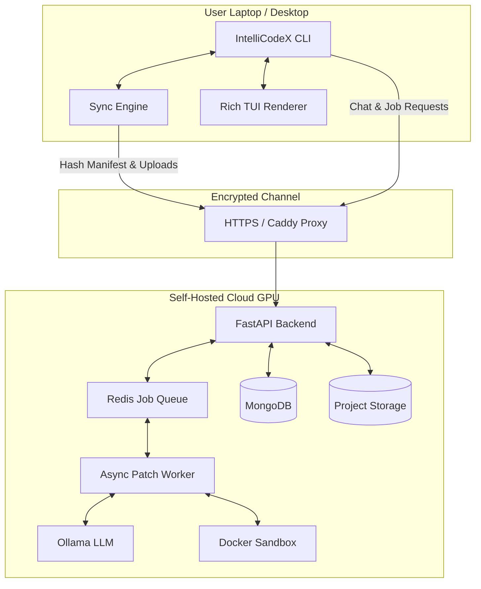

# IntelliCodeX Client-Server Architecture

This document outlines the architecture for the IntelliCodeX self-hosted client/server model, transitioning the platform from a strict local-only tool to a **privacy-preserving self-hosted server** system.

## High-Level Architecture

## Security & Privacy Boundary

- **No Cloud Vendor Lock-in**: The server is completely self-hosted by the user. Code goes *only* to a server the user explicitly controls.
- **Project Isolation**: Every repository gets a dedicated, isolated project directory on the server containing its specific FAISS index, SQLite metadata, and BM25 index.
- **Authentication**: JWT-based authentication with ownership verification on every endpoint.
- **Safe Sandboxing**: Patch verification happens inside a restricted Docker container on the server (`--network none`, CPU/memory limits, non-root user).
- **Path Guard**: Strict prevention of absolute paths and directory traversal (`../`) during client-server synchronization.

## API Contract

| Method | Endpoint | Purpose |
|:---|:---|:---|
| `POST` | `/api/auth/login` | Returns JWT (24-hour expiry) |
| `GET` | `/api/projects` | List projects owned by the user |
| `POST` | `/api/projects` | Initialize a new project |
| `POST` | `/api/projects/{id}/sync/manifest` | Send local file hashes, receive `[needed, deleted]` lists |
| `POST` | `/api/projects/{id}/sync/upload` | Upload specifically requested files incrementally |
| `POST` | `/api/projects/{id}/chat` | Query the repository (streams tokens) |
| `POST` | `/api/projects/{id}/patches` | Start an async patch + sandbox verification job |
| `GET` | `/api/jobs/{job_id}` | Poll job status, queue position, and results |

## Synchronization Protocol (Phase 4)

IntelliCodeX uses a highly optimized incremental sync engine to minimize payload sizes:
1. **Hash Walk**: Client walks the local repository, ignoring `__pycache__`, `.git`, etc., and computes a SHA-256 hash for each file.
2. **Manifest Negotiation**: Client POSTs the `{filepath: hash}` manifest to the server.
3. **Delta Calculation**: Server diffs the manifest against its database and returns a list of files it actually needs.
4. **Minimal Upload**: Client uploads *only* the modified files.
5. **Partial Re-index**: Server safely replaces the AST chunks and vectors for the updated files without rebuilding the entire FAISS index.
